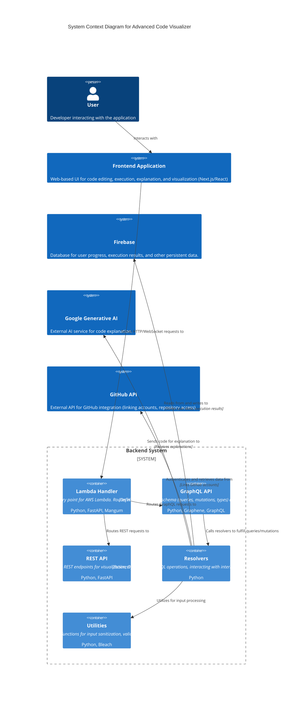
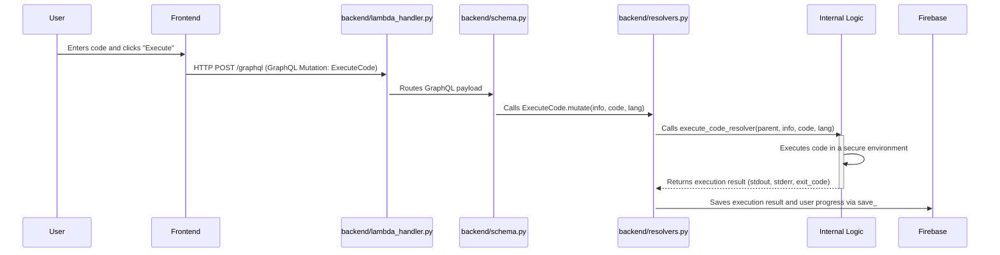

# advanced-code-visualizer

## 📋 Overview

The `advanced-code-visualizer` project is a sophisticated web application designed to empower developers with tools for interactive code execution, AI-driven code explanation, and insightful visualization. At its core, it provides a robust backend built with FastAPI and GraphQL, enabling a rich set of functionalities for managing and interacting with code snippets. Users can submit code for execution, receive detailed explanations generated by AI, and track their progress, all while benefiting from secure input handling and seamless integration with external services like GitHub.

The system leverages a GraphQL API, defined in `backend/schema.py`, to expose its capabilities through mutations like `ExecuteCode` for running code and `ExplainCode` for AI analysis. The `backend/resolvers.py` module houses the business logic for these operations, interacting with external AI models (via `google-generativeai`) and persistent storage (likely Firebase, given `pyrebase` dependency). The `backend/lambda_handler.py` acts as the primary entry point for API Gateway requests, routing them to the appropriate FastAPI or WebSocket endpoints, making it suitable for serverless deployments.

## ✨ Key Features

*   **Interactive Code Execution**: Submit code snippets in various languages for execution and receive results, powered by the `ExecuteCode` mutation and `execute_code_resolver`.
*   **AI-Powered Code Explanation**: Get detailed, AI-generated explanations for complex code, facilitated by the `ExplainCode` mutation and `explain_code_resolver` leveraging `google-generativeai`.
*   **Code Visualization**: Routes like `/viz` and `/output` in `backend/routes.py` suggest capabilities for visualizing code structure, execution flow, or results.
*   **User Progress Tracking**: Users can save and retrieve their progress and data through the `SaveProgress` mutation and `Query.resolve_user_progress`.
*   **GitHub Integration**: Link your GitHub account to the platform using the `LinkGitHub` mutation and `link_github_resolver` for potential repository analysis or code import.
*   **Secure Input Handling**: Utilizes `backend/utils.py` functions like `sanitize_input` (likely with `bleach`) and `validate_code_length` to ensure secure and valid code submissions.
*   **Real-time Interaction**: The `websocket_endpoint` in `backend/lambda_handler.py` indicates support for real-time communication, potentially for live execution feedback or collaborative features.

## 🏗️ Architecture

The system is structured into a frontend client and a serverless-ready Python backend. The backend serves as an API gateway, orchestrating requests between the client, internal services, and external APIs.



## 📊 Data Flow

Let's trace the data flow for a typical "Execute Code" request:


📁 advanced-code-visualizer/
├── 📄 Backend Request Handling Flow
├── 📄 Code Execution and Visualization Flow
├── 📄 GitHub Integration Flow
├── 📄 next.config.js
├── 📄 Overall System Architecture Flow
├── 📄 package.json
├── 📄 postcss.config.js
├── 📄 README.md
├── 📄 tailwind.config.js
├── 📄 tsconfig.json
├── 📁 backend/
│   ├── 📄 Dockerfile
│   ├── 🐍 lambda_handler.py [1cls] [2fn]
│   ├── 📄 requirements.txt
│   ├── 🐍 resolvers.py [4fn]
│   ├── 🐍 routes.py [4fn]
│   ├── 🐍 schema.py [11cls] [10fn]
│   └── 🐍 utils.py [2fn]
└── 📁 src/
    ├── 📁 app/
    │   ├── 📁 [locale]/
    │   │   ├── 📄 layout.tsx
    │   │   └── 📄 page.tsx
    │   ├── 📁 analyzer/
    │   │   └── 📁 [lang]/
    │   │       └── 📄 page.tsx
    │   ├── 📁 api/
    │   │   └── 📁 execute/
    │   │       └── 📄 route.ts
    │   └── 📁 visualizer/
    │       └── 📁 [lang]/
    │           └── 📄 page.tsx
    ├── 📁 components/
    │   ├── 📁 editor/
    │   │   └── 📄 CodeEditor.tsx
    │   ├── 📁 layout/
    │   │   ├── 📄 Footer.tsx
    │   │   └── 📄 Header.tsx
    │   └── 📁 ui/
    │       ├── 📄 AIExplanationButton.tsx
    │       ├── 📄 Button.tsx
    │       ├── 📄 ErrorBoundary.tsx
    │       ├── 📄 GitHubInstructionsModal.tsx
    │       ├── 📄 Input.tsx
    │       └── 📄 LangSelector.tsx
    ├── 📁 features/
    │   ├── 📁 analyzer/
    │   │   ├── 📁 components/
    │   │   │   ├── 📄 CallArrow.tsx
    │   │   │   ├── 📄 EdgeCaseSimulator.tsx
    │   │   │   └── 📄 ErrorPanel.tsx
    │   │   ├── 📁 hooks/
    │   │   │   └── 📄 useAnalyzerCache.ts
    │   │   └── 📁 utils/
    │   │       └── 📄 analyzerUtils.ts
    │   ├── 📁 common/
    │   │   ├── 📄 AlgoDetector.tsx
    │   │   └── 📄 DSVisualizer.tsx
    │   └── 📁 visualizer/
    │       ├── 📁 components/
    │       │   ├── 📄 C4Diagram.tsx
    │       │   ├── 📄 DependencyGraph.tsx
    │       │   └── 📄 ExecutionFlowDiagram.tsx
    │       ├── 📁 hooks/
    │       │   └── 📄 useVisualizerState.ts
    │       └── 📁 utils/
    │           └── 📄 vizUtils.ts
    ├── 📁 hooks/
    │   ├── 📄 useAstParser.ts
    │   ├── 📄 useCodeExecution.ts
    │   ├── 📄 useDebounce.ts
    │   ├── 📄 useExportGraph.ts
    │   ├── 📄 useFlowGraphBuilder.ts
    │   ├── 📄 useGitHubIntegration.ts
    │   ├── 📄 useStaticAnalyzer.ts
    │   ├── 📄 useThemeToggle.ts
    │   ├── 📄 useTracer.ts
    │   ├── 📄 useUndoRedo.ts
    │   └── 📄 useVisualization.ts
    ├── 📁 i18n/
    │   ├── 📄 request.ts
    │   └── 📁 messages/
    │       ├── 📄 en.json
    │       └── 📄 es.json
    ├── 📁 lib/
    │   ├── 📄 algoPatterns.ts
    │   ├── 📄 Config.ts
    │   ├── 📄 dsDetector.ts
    │   ├── 📄 Logging.ts
    │   ├── 📄 multiFileResolver.ts
    │   ├── 📄 tunnelUtils.ts
    │   ├── 📄 utils.ts
    │   ├── 📁 graph-generators/
    │   │   ├── 📄 c4Generator.ts
    │   │   ├── 📄 callGraph.ts
    │   │   ├── 📄 dependencyGraph.ts
    │   │   └── 📄 umlGenerator.ts
    │   ├── 📁 parsers/
    │   │   ├── 📄 langParsers.ts
    │   │   └── 📄 treeSitterInit.ts
    │   ├── 📁 static-checkers/
    │   │   └── 📄 pythonStatic.ts
    │   └── 📁 tracers/
    │       └── 📄 pythonTracer.ts
    ├── 📁 styles/
    │   └── 📄 globals.css
    └── 📁 types/
        └── 📄 index.ts
```
